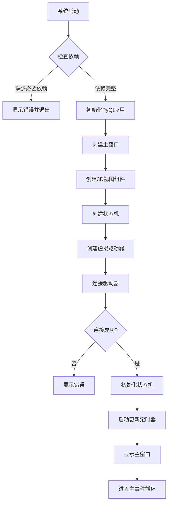
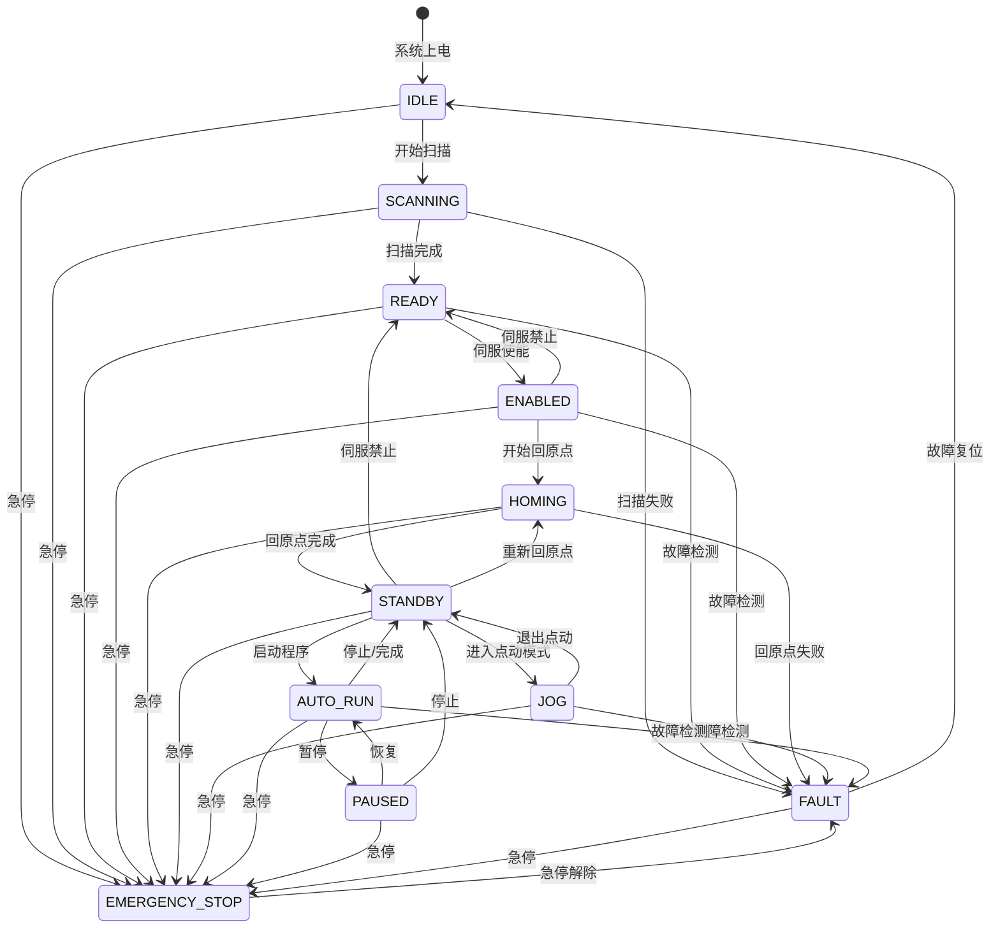
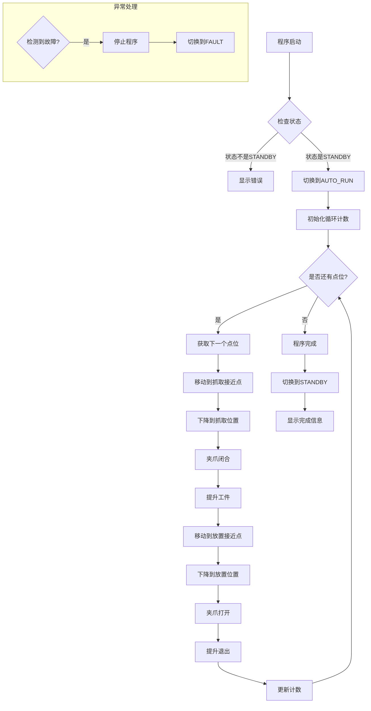
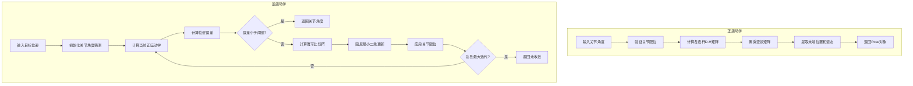
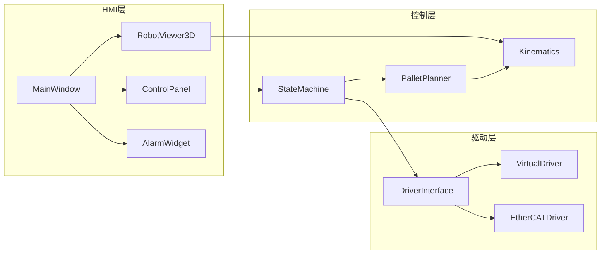

# 主程序流程图

## 系统启动流程

```mermaid
flowchart TD
    A[系统启动] --> B{检查依赖}
    B -->|缺少必要依赖| C[显示错误并退出]
    B -->|依赖完整| D[初始化PyQt应用]
    D --> E[创建主窗口]
    E --> F[创建3D视图组件]
    F --> G[创建状态机]
    G --> H[创建虚拟驱动器]
    H --> I[连接驱动器]
    I --> J{连接成功?}
    J -->|否| K[显示错误]
    J -->|是| L[初始化状态机]
    L --> M[启动更新定时器]
    M --> N[显示主窗口]
    N --> O[进入主事件循环]
```

## 状态机流程

```mermaid
stateDiagram-v2
    [*] --> IDLE: 系统上电
    
    IDLE --> SCANNING: 开始扫描
    SCANNING --> READY: 扫描完成
    SCANNING --> FAULT: 扫描失败
    
    READY --> ENABLED: 伺服使能
    READY --> FAULT: 故障检测
    
    ENABLED --> HOMING: 开始回原点
    ENABLED --> READY: 伺服禁止
    ENABLED --> FAULT: 故障检测
    
    HOMING --> STANDBY: 回原点完成
    HOMING --> FAULT: 回原点失败
    
    STANDBY --> JOG: 进入点动模式
    STANDBY --> AUTO_RUN: 启动程序
    STANDBY --> READY: 伺服禁止
    STANDBY --> HOMING: 重新回原点
    
    JOG --> STANDBY: 退出点动
    JOG --> FAULT: 故障检测
    
    AUTO_RUN --> STANDBY: 停止/完成
    AUTO_RUN --> PAUSED: 暂停
    AUTO_RUN --> FAULT: 故障检测
    
    PAUSED --> AUTO_RUN: 恢复
    PAUSED --> STANDBY: 停止
    
    FAULT --> IDLE: 故障复位
    
    IDLE --> EMERGENCY_STOP: 急停
    SCANNING --> EMERGENCY_STOP: 急停
    READY --> EMERGENCY_STOP: 急停
    ENABLED --> EMERGENCY_STOP: 急停
    HOMING --> EMERGENCY_STOP: 急停
    STANDBY --> EMERGENCY_STOP: 急停
    JOG --> EMERGENCY_STOP: 急停
    AUTO_RUN --> EMERGENCY_STOP: 急停
    PAUSED --> EMERGENCY_STOP: 急停
    FAULT --> EMERGENCY_STOP: 急停
    
    EMERGENCY_STOP --> FAULT: 急停解除
```

## 码垛程序流程

```mermaid
flowchart TD
    A[程序启动] --> B{检查状态}
    B -->|状态不是STANDBY| C[显示错误]
    B -->|状态是STANDBY| D[切换到AUTO_RUN]
    D --> E[初始化循环计数]
    E --> F{是否还有点位?}
    
    F -->|否| G[程序完成]
    F -->|是| H[获取下一个点位]
    
    H --> I[移动到抓取接近点]
    I --> J[下降到抓取位置]
    J --> K[夹爪闭合]
    K --> L[提升工件]
    L --> M[移动到放置接近点]
    M --> N[下降到放置位置]
    N --> O[夹爪打开]
    O --> P[提升退出]
    P --> Q[更新计数]
    Q --> F
    
    G --> R[切换到STANDBY]
    R --> S[显示完成信息]
    
    subgraph 异常处理
        T{检测到故障?}
        T -->|是| U[停止程序]
        U --> V[切换到FAULT]
    end
```

## 运动学计算流程

```mermaid
flowchart TD
    subgraph 正运动学
        A1[输入关节角度] --> A2[验证关节限位]
        A2 --> A3[计算各连杆D-H矩阵]
        A3 --> A4[累乘变换矩阵]
        A4 --> A5[提取末端位置和姿态]
        A5 --> A6[返回Pose对象]
    end
    
    subgraph 逆运动学
        B1[输入目标位姿] --> B2[初始化关节角度猜测]
        B2 --> B3[计算当前正运动学]
        B3 --> B4[计算位姿误差]
        B4 --> B5{误差小于阈值?}
        B5 -->|是| B6[返回关节角度]
        B5 -->|否| B7[计算雅可比矩阵]
        B7 --> B8[阻尼最小二乘更新]
        B8 --> B9[应用关节限位]
        B9 --> B10{达到最大迭代?}
        B10 -->|否| B3
        B10 -->|是| B11[返回未收敛]
    end
```

## 模块调用关系

```mermaid
flowchart LR
    subgraph HMI层
        MainWindow
        ControlPanel
        RobotViewer3D
        AlarmWidget
    end
    
    subgraph 控制层
        StateMachine
        PalletPlanner
        Kinematics
    end
    
    subgraph 驱动层
        DriverInterface
        VirtualDriver
        EtherCATDriver
    end
    
    MainWindow --> ControlPanel
    MainWindow --> RobotViewer3D
    MainWindow --> AlarmWidget
    
    ControlPanel --> StateMachine
    RobotViewer3D --> Kinematics
    
    StateMachine --> PalletPlanner
    PalletPlanner --> Kinematics
    
    StateMachine --> DriverInterface
    DriverInterface --> VirtualDriver
    DriverInterface --> EtherCATDriver
```
